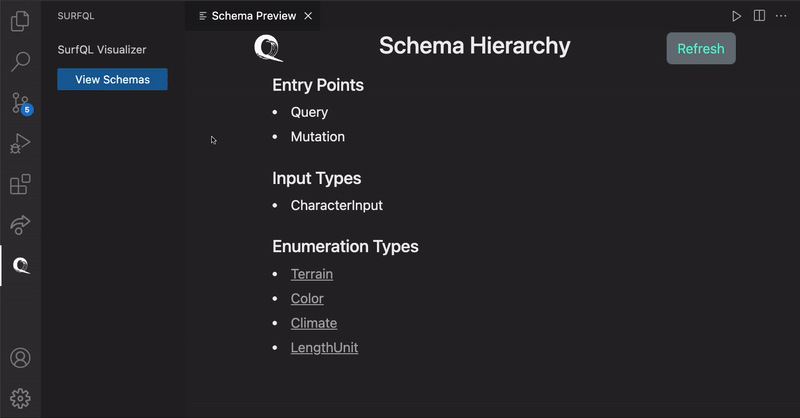

## SurfQL

SurfQL is a VS Code developer tool that displays user defined GraphQL schema in a visualizer and allows for autocompletion for your query using Intellisense.

## Functionality
Schema Visualization

Code Auto-completion


## Instructions

1. Go to VS Code marketplace and download SurfQL.
2. Once installed, the first time you open your project, follow the pop-up message to create a surfql.config.json file.
3. Click the Q logo that appears on your side bar, and click on the View Schemas Button to initiate the visualizer. It will open a webView panel with your visualization of the schema hierarchy. If you don't have a config file, you can also mannually select your schema file following the pop-up file selector manually.
(Currently SurfQL supports parsing schema files written with Apollo Server library. Support for more libraries is under development.)
4. Beyond visualization: Back to your project, once you begin building up your query in your project file, SurfQL will begin parsing your query and suggesting the available fields to complete your query. 


## Built With

<ul>
  <li>
     <a href="https://www.typescriptlang.org/"> Typescript </a>
  </li>
  <li>
    <a href="https://code.visualstudio.com/api"> VSCode Extension API </a>
  </li>
  <li>
    <a href="https://getbootstrap.com/docs/5.0/getting-started/introduction/"> Bootstrap V5.0</a>
  </li>
  <li>
    <a href="https://www.javascript.com/"> JavaScript</a>
  </li>
</ul>
Referencing
<ul>
  <li>
     <a href="https://graphql.org/"> GraphQL</a>
  </li>
  <li>
     <a href="https://www.apollographql.com/docs/apollo-server/"> Apollo</a>
  </li>
</ul>

## Supports
#### Parsing GraphQL Type Schemas:
- File types: [".graphql", ".graphqls", ".ts", ".js"]
- If your file containing the types is not listed, please open up an [issue](https://github.com/oslabs-beta/SurfQL/issues)

#### Autocomplete Suggestions:
- File types: [".js", ".jsx", ".ts", ".tsx"]
- If your file constructing the query is not listed, please open up an [issue](https://github.com/oslabs-beta/SurfQL/issues)

## Extension Settings

Make sure to include a configuration file named `surfql.config.json`

#### Example

```json
{
  "schema": "./<path to your graphql schema definition file>",
  "serverLibrary" : "Apollo Server"
}
```

<!-- ROADMAP -->

## Roadmap

- [ ] Create schema file parsing support for different libaries, eg. GraphQL.js, graphql-yoga, etc.
- [ ] Create a Postman type API that sits in VSCode
  - [ ] Create input fields for requests on the webview panel
  - [ ] Connect to the GraphQL API to return the data
  - [ ] Display the data in the panel


<!-- STEPS TO CONTRIBUTE -->

## Steps to Contribute

Contributions really make the open source community an amazing place to learn, inspire, and create. Any contributions made to surfQL are **appreciated**.

If you have a suggestion that would make this better, please fork the repo and create a pull request. You can also simply open an issue with the tag "enhancement".
Don't forget to give the project a star! Thanks again!

1. Fork & Clone SurfQL
2. Create your Feature Branch (`git checkout -b <github_username>/<YourAmazingFeature>`)
3. Make your Changes (See **Making Changes** below)
4. Commit your Changes (`git commit -m '<Your Commit Message>'`)
5. Push to the Branch (`git push origin <github_username>/<YourAmazingFeature>`)
6. Open a Pull Request

<!-- MAKING CHANGES -->

### Making Changes

1. Make your changes!
2. Re-compile and re-build your extension using the command line: `npm run compile` & `npm run build`
3. Press F5 (or use the VS Code Debug console) A new VS Code window should open in development mode. This is your debugging environment!
4. Repeat step 3 and refresh your debugging environment to test further changes.

<!-- THE SURFQL TEAM -->

## The SURFQL Team

- Ethan McRae [LinkedIn](https://www.linkedin.com/in/ethanmcrae/) | [Github](https://github.com/ethanmcrae)
- Tristan Onfroy [LinkedIn](https://www.linkedin.com/in/tristan-onfroy/) | [Github](https://github.com/TristanO45)
- Yanqi Joy Zhang [LinkedIn](https://www.linkedin.com/in/yanqi-joy-zhang-72a41b50/) | [Github](https://github.com/jzhang2018p)
- Steve Benner [LinkedIn](https://www.linkedin.com/in/stephenbenner/) | [Github](https://github.com/CodeBrewLatte)
- Dwayne Neckles [LinkedIn](https://www.linkedin.com/in/dneckles/) | [Github](https://github.com/dnecklesportfolio)

<!-- CONTACT US -->

## Contact Us

Email: [surfqlapp@gmail.com](surfqlapp@gmail.com)
Website: [http://www.surfql.com/](http://www.surfql.com/)
