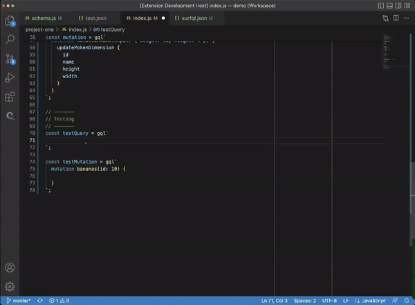
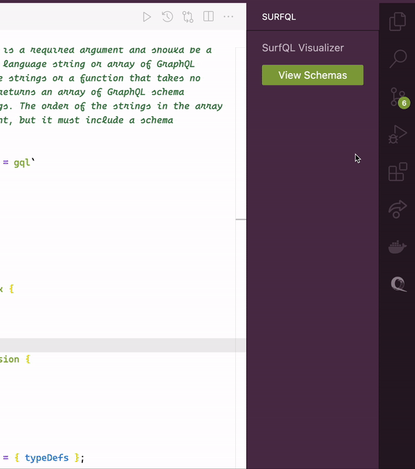

<!-- PROJECT LOGO -->
 

  
  
SURFQL:
A DEVELOPER TOOL FOR GRAPHQL

## SurfQL
SurfQL A VSCode extension to create way in the editor  to display the queries the user defines. This should make make it easier to developing GraphQl applications.

### Autocomplete

### Visualizer

<!-- # SurfQL

This is the README for your extension "surfql". After writing up a brief description, we recommend including
the following sections.

## Features

Describe specific features of your extension including screenshots of your extension in action. Image paths are relative to this README file.

For example if there is an image subfolder under your extension project workspace:

\!\[feature X\]\(images/feature-x.png\)

> Tip: Many popular extensions utilize animations. This is an excellent way to show off your extension! We recommend short, focused animations that are easy to follow.

## Requirements

If you have any requirements or dependencies, add a section describing those and how to install and configure them.

## Extension Settings

Include if your extension adds any VS Code settings through the `contributes.configuration` extension point.

For example:

This extension contributes the following settings:

* `myExtension.enable`: Enable/disable this extension.
* `myExtension.thing`: Set to `blah` to do something.

## Known Issues

Calling out known issues can help limit users opening duplicate issues against your extension.

## Release Notes

Users appreciate release notes as you update your extension.

### 1.0.0

Initial release of ...

--->

<!-- BUILT WITH -->
## Built With
<ul>
  <li>
     <a href="Next.js](https://nextjs.org/"> GraphQL</a>
  </li>
  <li>
    <a href="https://reactjs.org/"> React</a>
  </li>
  <li>
    <a href="https://code.visualstudio.com/api"> VSCode Extension API </a>
  </li>
  <li>
     <a href="https://www.typescriptlang.org/"> Typescript </a>
  </li>

</ul>

## Extension Settings
Make sure to include a configuration file named `surfql.json`

<!-- ROADMAP -->
## Roadmap

- [ ] Create a Postman type of panel that sits in VSCode
  - [ ] Create input fields for requests on the webview panel
  - [ ] Find a way to access to the developers DB or AP and return the data
- [ ] Make the parser handle schemas created

<!-- STEPS TO CONTRIBUTE -->
## Steps to Contribute

Contributions really make the open source community an amazing place to learn, inspire, and create. Any contributions made to surfQL are ** appreciated**.

If you have a suggestion that would make this better, please fork the repo and create a pull request. You can also simply open an issue with the tag "enhancement".
Don't forget to give the project a star! Thanks again!

1. Fork & Clone SurfQL
2. Create your Feature Branch (`git checkout -b <github_username>/<YourAmazingFeature>`)
3. Make your Changes (See **Making Changes** below)
4. Commit your Changes (`git commit -m '<Your Commit Message>'`)
5. Push to the Branch (`git push origin <github_username>/<YourAmazingFeature>`)
6. Open a Pull Request

<!-- MAKING CHANGES -->
### Making Changes

1. Make your changes!
2. Open /surfQL/src/extension.ts and save any changes you made
3. Re-compile and re-build your extension using the command line: `npm run compile` & `npm run build`
4. Press F5. A new VSCode window should open. This is your debugging environment!
5. Repeat step 3 and refresh your debugging environment to test further changes

<!-- THE SURFQL TEAM -->
## The SURFQL Team

* Ethan McRae [LinkedIn](https://www.linkedin.com/in/ethanmcrae/) | [Github](https://github.com/ethanmcrae)
* Tristan Onfroy [LinkedIn](https://www.linkedin.com/in/tristan-onfroy/) | [Github](https://github.com/TristanO45)
* Joy Zhang [LinkedIn](https://www.linkedin.com/in/yanqi-zhang-72a41b50/) | [Github](https://github.com/jzhang2018p)
* Steve Benner [LinkedIn](https://www.linkedin.com/in/stephenbenner/) | [Github](https://github.com/CodeBrewLatte)
* Dwayne Neckles [LinkedIn](https://www.linkedin.com/in/dneckles/) | [Github](https://github.com/dnecklesportfolio)

<!-- CONTACT US -->
## Contact Us
Email: [surfqlapp@gmail.com](surfqlapp@gmail.com)

Website: [http://surfql-static-site.s3-website-us-east-1.amazonaws.com/](http://surfql-static-site.s3-website-us-east-1.amazonaws.com/)

